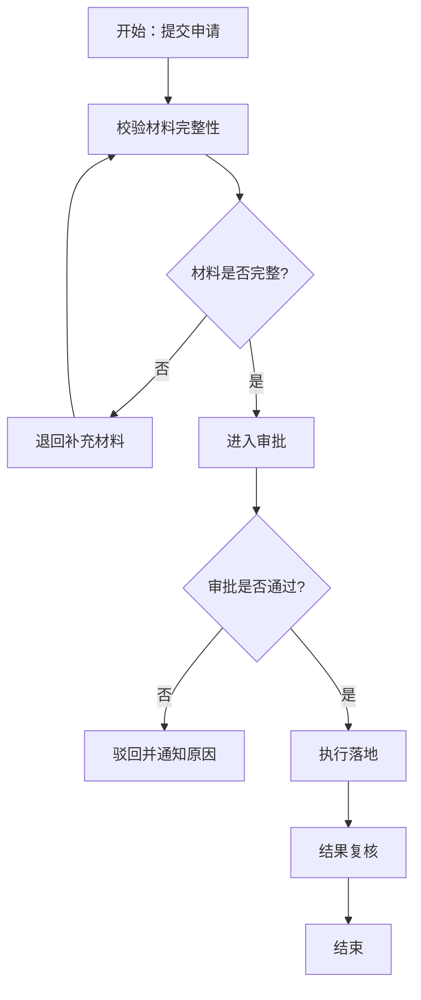

# 流程图设计与生成技能

## ⚡ 激活声明（ACTIVATION DECLARATION）

**【强制执行】每次调用本技能时，必须在回复的最开头输出以下激活声明，不得省略、延后或跳过：**

```
✅ [flowchart-generator skill 已激活]
正在按照 flowchart-generator skill SOP 执行流程图设计任务。
```

激活声明必须是回复的第一句话，出现在任何分析、代码或内容之前。

---

## 📋 步骤完成声明（STEP COMPLETION DECLARATION）

**【强制执行】每完成 SOP 中的一个步骤后，必须立即输出对应的步骤完成声明，格式如下：**

```
✅ [Step N 完成] <步骤名称> — <一句话说明本步骤的执行结果>
```

示例：
- `✅ [Step 1 完成] 识别流程类型 — 本流程为执行流，目标是对线上用户进行分层分类。`
- `✅ [Step 2 完成] 抽取流程要素 — 已识别目标、角色、输入输出、关键决策点共5项要素。`
- `✅ [Step 3 完成] 搭建主流程 — 已建立从"开始"到"结束"的7节点闭环主链路。`
- `✅ [Step 4 完成] 补齐分支与异常 — 已添加3个判断节点和1条异常回退路径。`
- `✅ [Step 5 完成] 生成流程图 — Mermaid 流程图已输出，语法有效，结构完整。`
- `✅ [Step 6 完成] 生成人类可读说明 — 已输出节点说明、风险点和优化建议。`
- `✅ [Step 7 完成] 质量校验 — 已通过全部5项质量检查，无孤立节点，流程闭环。`

步骤完成声明必须紧跟在该步骤的输出内容之后，不得批量合并到最后统一输出。

---

## 🏁 任务完成声明（TASK COMPLETION DECLARATION）

**【强制执行】所有步骤执行完毕后，必须在回复末尾输出以下任务完成声明：**

```
🎉 [flowchart-generator skill 执行完毕]
已完成全部 7 个 SOP 步骤，输出内容包括：流程图（Mermaid）+ 流程解释文档。
质量检查：通过 ✅
```

---

## 技能目标

本技能用于从业务目标出发，自动设计并生成一个完整流程图，并提供可执行解释，确保流程可评审、可落地、可迭代。

---

## 可完成事项

- 将自然语言需求转成结构化流程
- 设计完整流程骨架：开始、结束、主干步骤、判断分支
- 为每个判断节点补充"是/否"或"满足/不满足"去向
- 增加异常处理与回退路径，避免流程断点
- 输出标准化流程图文本（Mermaid）
- 同步输出流程解释：节点目的、输入输出、风险点、优化建议

---

## 输入要求

用户至少提供以下信息中的 2~3 项：

- 流程目标（要解决什么问题）
- 参与角色（谁发起、谁处理、谁审批）
- 关键约束（时间、合规、预算、权限）
- 期望输出（仅流程图 / 流程图 + 说明）

若信息不全，先补全最小可执行假设再生成流程。

---

## 输出规范

### 输出 1：流程图（必须）

使用 Mermaid `flowchart TD` 语法，必须包含：

- 1 个开始节点
- 1 个结束节点
- 主干处理节点（不少于 4 个）
- 判断节点（不少于 2 个）
- 至少 1 条异常分支
- 节点命名清晰、无歧义

### 输出 2：流程解释（必须）

至少包含：

- 流程概述（1 段）
- 节点说明（逐节点）
- 风险与控制点
- 可优化建议（至少 2 条）

---

## SOP（严格执行）

> 每完成一步，必须立即输出对应的【步骤完成声明】，再继续下一步。

1) 识别流程类型
- 判断是审批流、执行流、处置流、还是服务流程。
- **完成后输出：** `✅ [Step 1 完成] 识别流程类型 — ...`

2) 抽取流程要素
- 抽取目标、角色、输入、输出、约束、关键决策点。
- **完成后输出：** `✅ [Step 2 完成] 抽取流程要素 — ...`

3) 搭建主流程
- 从"开始"到"结束"建立最短闭环链路。
- **完成后输出：** `✅ [Step 3 完成] 搭建主流程 — ...`

4) 补齐分支与异常
- 对关键节点加入判断分支；为失败场景添加回退/补救路径。
- **完成后输出：** `✅ [Step 4 完成] 补齐分支与异常 — ...`

5) 生成流程图
- 以 Mermaid 输出可渲染流程图，保证结构完整。
- **完成后输出：** `✅ [Step 5 完成] 生成流程图 — ...`

6) 生成人类可读说明
- 解释每个节点做什么、为什么这样设计、可能风险与改进点。
- **完成后输出：** `✅ [Step 6 完成] 生成人类可读说明 — ...`

7) 质量校验
- 检查是否存在孤立节点、无出口节点、循环死链、缺失结束节点。
- **完成后输出：** `✅ [Step 7 完成] 质量校验 — ...`

---

## 质量检查清单

生成后必须检查：

- 流程图可渲染（Mermaid 语法有效）
- 节点和分支命名清晰
- 每个判断节点至少有 2 个出口
- 有异常路径且能回收或终止
- 流程解释与图中节点一一对应

---

## 失败与兜底策略

- 信息不足：基于行业通用流程先给"基础版流程图"，并明确假设
- 场景过复杂：先输出"一级主流程"，再分模块展开二级子流程
- 术语冲突：采用用户术语优先，并在说明中给映射关系

---

## 输出模板（示例）



说明输出应包含：

- 概述：该流程用于...
- 节点说明：A/B/C...
- 风险点：如材料反复退回导致时延...
- 优化建议：如增加预检清单、并行审批等

---

## 适配场景示例

- "帮我设计信用卡 AI 外呼流程图并说明每个节点话术触发条件"
- "帮我生成一个客服投诉升级处理流程图"
- "为新品上线做一个跨部门审批流程图，含异常回滚"

---

## 使用约束

- 流程图必须完整闭环，不输出碎片节点
- 不输出与目标无关的装饰性节点
- 优先保证可执行性，再追求复杂度
