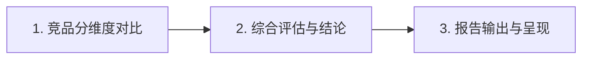

# 竞品对比分析 SOP

---

## 概述

本技能提供标准化的竞品对比分析方法论与执行流程，帮助系统化地完成竞品调研与分析工作。

## 分析流程总览

---

## 1. 竞品分维度对比

> **目标**：以用户体验五要素为完整框架，逐项对比将零散信息转化为结构化的竞争格局认知。

### 1.1 战略层（产品"为什么存在"）

**定义**：战略层回答产品的根本性问题——"我们为什么要开发产品？"它是整个五要素的顶层设计，决定了其他四个层级的方向和边界。分析时需从用户需求和商业价值两个核心视角审视竞品的核心选择。

**分析子项**：

| 子项 | 说明 |
|------|------|
| **用户痛点** | 产品为谁服务、解决了用户的哪些核心痛点、用户是谁 |
| **商业价值** | 产品为公司带来的商业价值、盈利模式是怎么样的 |
| **市场现状和预期** | 当前市场状况、是否存在竞品及其优缺点、市场预期如何 |
| **项目风险** | 产品上线后的潜在风险、如何规避风险、是否有准备解决方案 |
| **产品定位** | 产品在市场中的独特位置和价值主张 |
| **目标用户** | 核心服务人群及其特征（年龄/地域/消费能力/行为习惯） |

---

### 1.2 范围层（产品"提供什么"）

**定义**：范围层解决"我们要开发什么样的产品？"的问题——具体提供哪些功能、哪些服务、哪些内容，不做什么。它将战略层的抽象目标转化为具象的功能清单和内容需求，是战略到执行的桥梁。

**分析子项**：

| 子项 | 说明 |
|------|------|
| **项目背景和目标** | 项目的背景和目标、产品发展规划 |
| **功能概述** | 功能总体的了解、功能列表或功能结构图、产品模块划分和结构图 |
| **需求说明** | 对每个需求进行整理说明排期、需求池管理 |
| **非功能需求** | 安全性、性能等影响用户体验的非功能特性 |
| **功能完整度差异** | 与竞品相比独有/缺失/领先的功能点 |

---

### 1.3 结构层（产品"如何运作"）

**定义**：结构层关注产品的信息架构和交互逻辑——制作提交各种原型图，明确功能和内容如何组织、用户如何操作完成任务。它是范围层的功能清单转化为用户可理解和操作的逻辑结构。

**分析子项**：

| 子项 | 说明 |
|------|------|
| **产品结构** | 产品呈现给用户的页面和功能结构（如聊天页、好友页、个人中心等），建议用思维导图列明 |
| **信息架构** | 产品呈现给用户的信息的组织方式（如商品信息包含介绍、参数、评价等），建议用思维导图展开 |
| **页面结构** | 产品的功能和信息在页面上怎么体现、每个页面大概包括哪些内容，建议以低保真原型图呈现 |
| **交互流程** | 用户的操作流程和页面跳转流程、用户怎么执行操作、页面以什么方式响应或跳转 |

---

### 1.4 框架层（产品"长什么样"）

**定义**：框架层将产品从抽象逐步到具体——通过PRD和低保真原型图逐步细化成高保真原型图，基本能看出产品轮廓。

**分析子项**：

| 子项 | 说明 |
|------|------|
| **信息设计** | 对已定义好的信息架构进行细化（如商品详情细化为名称、数量、产地等详细字段） |
| **页面细化** | 在页面结构基础上进一步细化，如页面具体布局、页面元素选择等，将低保真细化为高保真 |
| **交互设计** | 页面的交互设计、用户操作后页面的响应（如弹窗提示、滑动效果等） |
| **导航设计** | 全局导航、局部导航、辅助导航的设计方案 |
| **表单与输入设计** | 关键表单的字段排布、校验规则、键盘类型 |

---

### 1.5 表现层（产品"什么感官体验"）

**定义**：表现层是用户最直观感知的视觉和感官层面——由UI设计师进行创意美感设计，给予产品美感体验。它决定了产品的第一印象和品牌感知，也直接影响使用愉悦度。

**分析子项**：

| 子项 | 说明 |
|------|------|
| **色彩体系** | 主色/辅色/中性色的搭配规范和使用场景 |
| **字体与排版** | 字体选择、字号层级、行间距、对齐方式 |
| **版式节奏** | 页面的留白、密度、视觉流动引导 |
| **视觉质感与动效** | 图标风格(线面/3D/插画风)、圆角规范、过渡动画 |
| **品牌一致性** | 视觉语言是否统一、是否符合品牌调性 |
| **情感化设计** | 是否有情感化元素（空状态插画、加载动画、微交互等）提升使用愉悦度 |

**输出物**：五要素逐层对比表（含各子项详细对比） + 核心流程走查表 + 交互/视觉评分总评（五星制）

---

## 2. 综合评估与结论

> **目标**：整合各维度对比发现，形成全局洞察和可指导行动的结论建议。

### 2.1 优劣势分析

- 各竞品SWOT分析（输入必须来自第2阶段对比事实，禁止凭空想象）
- 自身定位对标：领导者/挑战者/利基者/新进入者 + UVP清晰度 + 最大差异点
- 竞争格局研判：市场阶段 / 竞争强度 / 格局特征（垄断/寡头/碎片化）

**输出物**：SWOT分析表（每条标注来源维度）+ 竞争格局定位表

### 2.2 差距与机会识别

- 差距量化：领先/持平/落后(约差X%)三档表述 → 生成差距热力图
- 市场空白点挖掘：用户痛点地图 / 功能空白 / 体验空白 / 客群空白
- 机会点提炼：按投入产出比排序，筛选高价值+可行

**输出物**：差距热力图（🟢领先 ⚪持平 🔴落后）+ 机会点清单

### 2.3 策略建议输出

- 短期(0-3月)：快速修复短板 / 小成本体验优化 / 追基础能力
- 中长期(3-12月)：差异化调整 / 新功能规划 / 商业模式优化
- 资源优先级：P0/P1/P2分级，每条标注(建议动作+预期收益+所需资源+风险提示)
- **强制包含避坑指南**：不建议做的事及理由

**输出物**：短期建议表 + 中长期方向表 + 避坑指南

---

## 3. 报告输出与呈现

> **目标**：将分析成果转化为清晰、有说服力、可传播的报告交付物。

- 标准结构：**执行摘要 → 分析背景与方法 → 竞品概况 → 分维度对比（五要素逐层）→ 综合评估 → 策略建议 → 附录**

**输出物**：完整报告文档

---

## 兜底机制

> 以下规则贯穿全流程，可在任意阶段触发。

### 核心原则

| 编号 | 原则 | 说明 |
|------|------|------|
| R1 | **80/20原则** | 资源不足时聚焦核心竞品×五要素核心层级（战略层+范围层+表现层），其余层级标注"待深入" |
| R2 | **置信度分级** | 🟢高(官方/一手) 🟡中(第三方/多源一致) 🔴低(单源/推断) |
| R3 | **渐进交付** | 按"五要素逐层对比→综合评估→策略建议"分阶段交付，每阶段可独立阅读 |
| R4 | **来源留痕** | 每条结论（含各层子项对比结论）可追溯来源，缺失则降级为"未经证实" |
| R5 | **中立声明** | 利益相关方分析需声明偏倚，以原始事实说话 |
| R6 | **版本快照** | 网上信息保存本地副本，防止页面变更或下线 |

### 应急降级方案：数据不足时的处理

当部分或全部子项数据无法获取时，按以下规则处理：

**数据获取优先级**：官方渠道 → 应用商店/用户评价 → 第三方数据平台(SimilarWeb/AppAnnie等) → 社交媒体/社区讨论 → 新闻报道 → 合理推断(最后手段)

**缺失数据处理规则**：

| 情况 | 处理方式 |
|------|---------|
| 完全无法获取 | 标注 **"数据暂缺"**，不编造不猜测，围绕可获取的子项继续分析 |
| 仅有定性信息无定量数据 | 做定性判断（较强/一般/较弱），标 🟡中置信度 + 来源 |
| 单一非官方来源 | 如实记录，标 🔴低置信度 + 来源URL |
| 可通过产品界面反推（范围/结构/框架/表现层） | 基于截图走查推断，标 🔴低置信度 + "基于界面推断" |
| 多源信息矛盾 | 列出各方数据并说明矛盾点，标 ⚠️ 存在分歧 |
| **几乎拿不到数据**（极端情况） | 仅基于官网+商店页+公开新闻做信息拼图，重点覆盖战略层和表现层，其余层级基于截图推断；输出轻量概况报告(5-10页)，所有推断性结论标 🔴低置信度 |

> **核心原则：宁可"数据暂缺"也不凭空编造。缺失不等于分析停止——围绕可获取的子项深入分析，同样能产出有价值的洞察。**

---

## 附注

- 本SOP为通用方法论框架，实际执行时应根据行业特点和项目具体情况进行适配
- 兜底机制的目的是确保"在任何情况下都能产出有价值的结果"，而非降低质量标准
